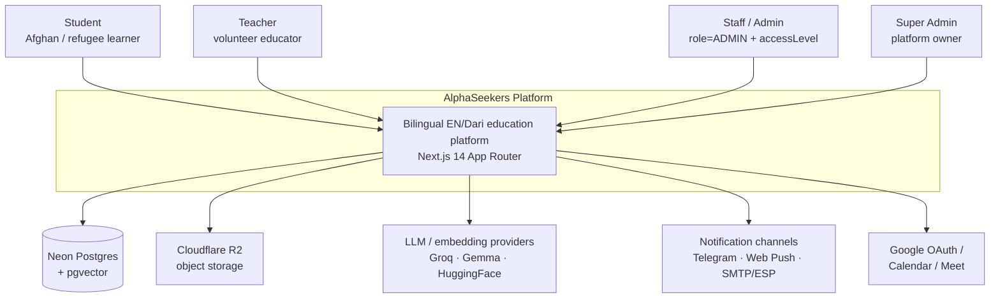
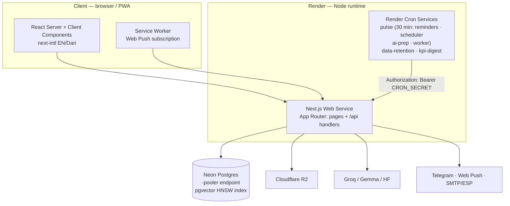
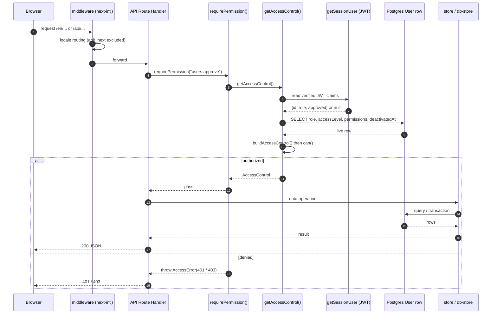
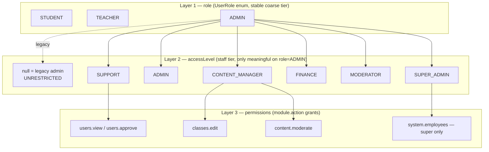
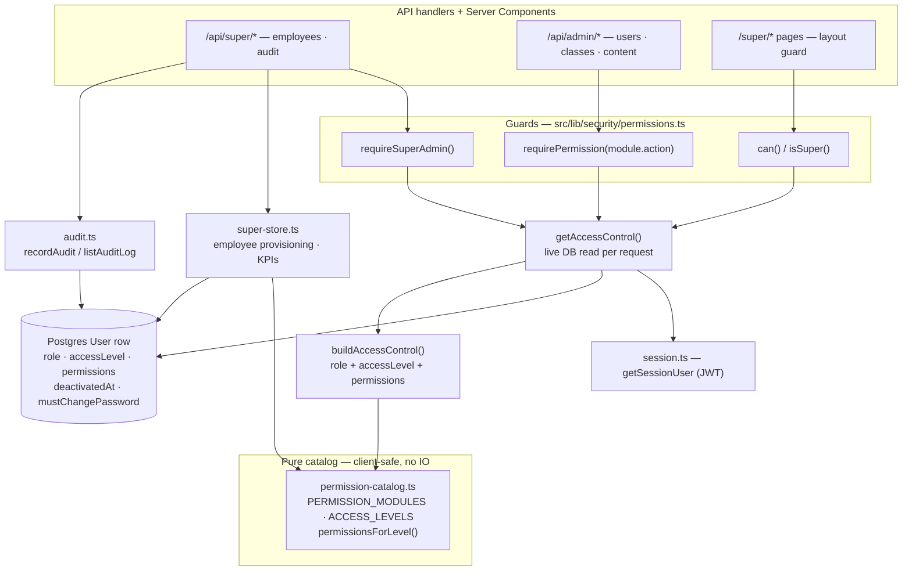
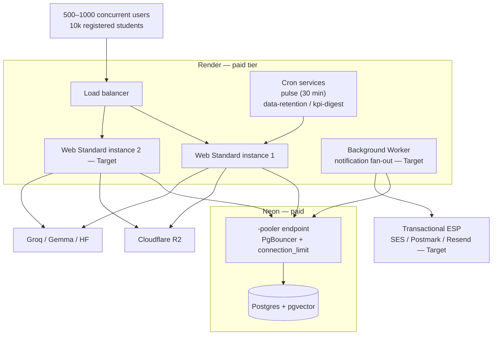

# AlphaSeekers — System Architecture

> A bilingual (English / Dari) education platform for Afghan and refugee learners.
> Next.js 14 App Router · TypeScript · Prisma 6 + Neon Postgres · NextAuth 4 ·
> next-intl · Cloudflare R2 · a pgvector-backed RAG tutor · Render.

This document is the architectural reference for the platform. It describes the
system as it exists in code today, the design decisions behind the recent
production-hardening and Super Admin work, and the scaling path from the current
single-instance deployment to the target of 10,000 registered students. Every
claim below is anchored to a specific file; where a capability is planned but not
yet in code it is explicitly marked **Target** or **Proposed**.

The companion documents are:

- [`docs/DIAGRAMS.md`](./DIAGRAMS.md) — every Mermaid diagram in one place.
- [`docs/adr/`](./adr/) — the Architecture Decision Records referenced throughout.
- `docs/DEPLOYMENT_RUNBOOK.md` — the operational deploy guide.
- The production-readiness audit that drove the hardening pass (referenced as
  "the audit" below).

---

## 1. System overview & context

AlphaSeekers connects volunteer teachers with students who often have limited
bandwidth, intermittent connectivity, and a first language of Dari. The platform
provides live classes (with Google Meet links and attendance), a bilingual
content/"student voices" surface, an AI study assistant grounded in course
materials via retrieval-augmented generation, and a multi-channel notification
system (Telegram, Web Push, email) so reminders reach students on whatever
channel they actually use.

The system is a single Next.js 14 application deployed as a long-running Node
service on Render, backed by a single Neon Postgres database. There is no
separate API tier: the App Router hosts both the rendered UI (React Server and
Client Components, localized with next-intl) and the JSON API (92 `route.ts`
handlers under `src/app/api`). State that must survive a deploy or spin-down
lives in Postgres; object uploads live in Cloudflare R2; AI inference is
delegated to external providers (Groq, Gemma, HuggingFace embeddings).

**Primary actors**

| Actor | Description | Coarse tier |
| --- | --- | --- |
| Student | Afghan / refugee learner; enrolls, attends, uses the AI tutor, publishes posts | `role = STUDENT` |
| Teacher | Volunteer educator; owns classes, marks attendance, issues check-in codes | `role = TEACHER` |
| Staff / Admin | Operates the platform surface (users, classes, content, analytics) | `role = ADMIN` + `accessLevel` |
| Super Admin | Provisions staff, assigns access, reads KPIs and the audit trail | `role = ADMIN` + `accessLevel = SUPER_ADMIN` |

### 1.1 Context diagram (C4 level 1)



---

## 2. Containers (C4 level 2)

The deployable units are the Next.js web service, a set of Render **cron
services** that drive scheduled work by calling the app's own authenticated cron
endpoints, and the managed data/inference dependencies. Notably, background work
is triggered **out of the user request path** by cron services rather than by an
in-app scheduler (`render.yaml:113-181`), which keeps user-facing latency
independent of batch fan-out.



**Data layer boundary.** Application code never imports Prisma ad hoc for the
core domain; it goes through the `src/lib/platform/store.ts` facade, which
dispatches to `db-store.ts` (the Postgres implementation) and, only in demo/dev,
to `memory-store.ts`. This facade is the seam where the read/write fallback
policy is enforced (see §3 and [ADR-0001](./adr/0001-remove-silent-db-fallback.md)).

---

## 3. Request lifecycle

A request traverses four concerns in order: **locale routing → authentication →
authorization → data access**. The authorization step is the architecturally
interesting one, because it re-reads the live database row on every request
rather than trusting the JWT — this is what makes deactivation and permission
changes take effect immediately.

1. **Middleware (`middleware.ts`).** next-intl's middleware handles locale
   prefixing for page routes. Its matcher deliberately excludes `api`, `_next`,
   and static assets (`middleware.ts:8`), so API handlers are *not* wrapped by
   i18n middleware and do their own auth.

2. **Authentication (`src/lib/auth.ts`, `src/lib/security/session.ts`).**
   NextAuth issues a JWT session (`strategy: "jwt"`, 7-day `maxAge`, hourly
   `updateAge` — `auth.ts:53-60`). `getSessionUser()` reads the verified claims
   (`session.ts:15-31`). Crucially, the `jwt` callback re-validates the user
   against the database on a 5-minute cadence (`REVALIDATE_INTERVAL_MS`,
   `auth.ts:21`, `auth.ts:183-202`): a deleted user has all claims stripped
   (`revokeToken`, `auth.ts:28-34`), and role/approval changes propagate without
   waiting for the 7-day token to expire. This is the session-revocation path.

3. **Authorization (`src/lib/security/permissions.ts`).** Guards
   `requireSuperAdmin()` and `requirePermission("module.action")` call
   `getAccessControl()`, which reads the live `User` row —
   `role, accessLevel, permissions, deactivatedAt, mustChangePassword`
   (`permissions.ts:125-145`) — and folds it into an `AccessControl` via
   `buildAccessControl()`. `can()` returns `true` for unrestricted admins,
   otherwise checks the permission set; a `deactivated` account is a hard stop
   (`permissions.ts:107-111`). See §5.

4. **Data access (`store.ts` → `db-store.ts`).** The handler calls the store
   facade. Reads may fall back to memory **only in demo/dev**; writes are
   database-only in production and never silently swallowed (§3.1).

### 3.1 Request sequence



### 3.2 The store facade and fallback policy

`store.ts` splits the old catch-all fallback into two explicit paths
(`store.ts:73-148`):

- **`runWithFallback` (reads).** Database-first. On an *infrastructure* error it
  invalidates a 30-second availability cache and serves a memory read — but only
  when `runtime.allowDbFallback` is true, which is false in production. Reads are
  non-destructive, so a stale demo read during a blip is acceptable in dev.
- **`runWrite` (writes).** Database-only when a database is authoritative. A
  write **never** silently falls back to memory; on infra failure it invalidates
  the availability cache and rethrows so the caller returns 5xx and the client
  can retry. The only exception is demo/dev with no configured DB, where memory
  legitimately *is* the backend of record.

Both paths classify errors: `isBusinessRuleError()` (`store.ts:45-62`)
distinguishes "Class is full" / "Student not found" (which must surface to the
caller as 4xx) from genuine connectivity failures (which trigger a re-probe).
The old design could not tell these apart, so an ordinary full-class rejection
would flip the whole process into a mock store. This is the subject of
[ADR-0001](./adr/0001-remove-silent-db-fallback.md).

---

## 4. Data model

The schema (`prisma/schema.prisma`) models learners, classes and their sessions,
the enrollment/attendance graph, multi-channel notifications, the AI-tutor
interaction record, community posts, and a privileged-action audit log. The
diagram below shows the nine core entities the task calls out; the full schema
also includes RAG (`DocumentChunk` with a `vector(384)` column and HNSW index),
spaced-repetition, homework, and hardening tables (`RateLimitBucket`,
`ClassAnnouncement`, `SiteSettings`).

```mermaid
erDiagram
    User ||--o{ Class : "teaches"
    User ||--o{ Enrollment : "enrolls"
    User ||--o{ Attendance : "attends"
    User ||--o{ Notification : "receives"
    User ||--o{ AIInteraction : "asks"
    User ||--o{ StudentPost : "authors"
    Class ||--o{ Session : "has"
    Class ||--o{ Enrollment : "roster"
    Session ||--o{ Attendance : "records"

    User {
        string id PK
        string email UK
        UserRole role
        string accessLevel "staff tier; null = legacy admin"
        json permissions "module.action grants"
        datetime deactivatedAt "immediate deactivation"
        boolean mustChangePassword
        datetime approvedAt
    }
    Class {
        string id PK
        string teacherId FK
        int maxStudents
        ClassStatus status
    }
    Session {
        string id PK
        string classId FK
        datetime startTime
        string checkinCode "second-layer attendance proof"
    }
    Enrollment {
        string id PK
        string studentId FK
        string classId FK
        EnrollmentStatus status
    }
    Attendance {
        string id PK
        string sessionId FK
        string studentId FK
        boolean attended
        boolean checkinVerified
    }
    Notification {
        string id PK
        string userId FK
        string dedupeKey "unique with channel"
        NotificationChannel channel
        NotificationStatus status
    }
    AIInteraction {
        string id PK
        string userId FK
        string provider "groq / gemma / cache"
        int responseMs
    }
    StudentPost {
        string id PK
        string authorId FK
        string slug UK
        string status "draft / pending_review / published"
    }
    AuditLog {
        string id PK
        string actorId "not FK-constrained by design"
        string action
        string targetType
        string targetId
    }
```

**Modeling notes and invariants**

- **Enrollment uniqueness & capacity.** `@@unique([studentId, classId])`
  (`schema.prisma:178`) prevents duplicate enrollments; the class-capacity
  invariant (`activeCount < maxStudents`) is *not* expressible as a constraint,
  so it is enforced transactionally (§6.3).
- **Attendance dedupe.** `@@unique([sessionId, studentId])` (`schema.prisma:198`)
  makes attendance marking idempotent per student per session.
- **Notification idempotency.** `@@unique([dedupeKey, channel])`
  (`schema.prisma:295`) lets a retried reminder batch skip already-sent
  notifications without a duplicate.
- **Indexing for hot paths.** The hardening pass added the indexes the audit
  found missing: `Session @@index([classId]), ([startTime]), ([classId, startTime])`
  (`schema.prisma:163-165`); `Enrollment @@index([classId])` (`schema.prisma:181`);
  `Attendance @@index([studentId])` (`schema.prisma:202`);
  `Notification @@index([userId, createdAt])` (`schema.prisma:294`);
  `User @@index([role]), ([approvedAt]), ([accessLevel])` (`schema.prisma:108-111`).
- **AuditLog is intentionally un-joined.** `actorId` is a plain string, not a
  foreign key (`schema.prisma:434-449`): the audit trail must remain valid even
  if the acting user is later deleted, so it stores a denormalized `actorEmail`
  snapshot instead of a relation.

---

## 5. The three-layer access-control model

The Super Admin work introduced a staff authorization model that layers on top
of the existing role system **without changing it**. The design goal was to add
fine-grained staff scoping while guaranteeing that every pre-existing admin kept
working unchanged. This is the subject of
[ADR-0002](./adr/0002-super-admin-access-model.md).



**Layer 1 — `role` (`UserRole`: STUDENT / TEACHER / ADMIN).** Unchanged. Every
existing role gate still works. This remains the coarse, stable auth tier.

**Layer 2 — `accessLevel` (nullable string on the `User` row).** A staff tier
layered on `role = ADMIN`. `SUPER_ADMIN` sits above a regular `ADMIN`; preset
levels (`CONTENT_MANAGER`, `FINANCE`, `MODERATOR`, `SUPPORT`) seed a sensible
default permission set (`permissionsForLevel()`, `permission-catalog.ts:90-118`).

**Layer 3 — `permissions` (JSON array of `"module.action"` strings).** Granular
grants enforced by `can()`. The catalog of valid modules/actions lives in a
**client-safe, IO-free module** (`permission-catalog.ts`) so the employee-management
UI can render the permission grid, while the IO-bound guards live in
`permissions.ts` and re-export the catalog (`permissions.ts:24-39`).

### 5.1 Backward-compatibility rationale

The critical design rule is in `buildAccessControl()` (`permissions.ts:82-103`):

> A legacy `ADMIN` with `accessLevel = null` **and** `permissions = null` is
> treated as **UNRESTRICTED** (full admin), so nothing regresses. Every employee
> the super console creates is given an explicit permission set, so employees are
> always scoped.

Concretely, `unrestricted = isSuper || (isAdmin && !hasExplicitScope)`. This
means:

- Pre-existing admins (no `accessLevel`, no `permissions`) → `unrestricted`, i.e.
  `can()` returns `true` for everything. Zero migration required.
- New employees always receive an explicit `accessLevel` + `permissions`
  (`super-store.ts:141-165`), so `hasExplicitScope` is true and they are scoped
  to exactly their grants.
- A `SUPER_ADMIN` (or a configured legacy super-admin email allowlist in
  `superadmin.ts`) is always unrestricted and additionally passes `isSuper()`.

This is validated exhaustively by `tests/rbac.test.ts` (legacy admins remain
unrestricted; scoped employees are limited; deactivation is a hard stop;
`can(null, …)` is false).

### 5.2 RBAC / Super-Admin component diagram (C4 level 3)



**Super console surface.** `src/app/[locale]/super/*` (guarded at the layout by
`isSuper()`, `super/layout.tsx:15-24`) provides employee provisioning, an
access-level + permission-grid editor, a KPI dashboard, an audit log viewer, and
a system-health page. Its API lives at `src/app/api/super/*` behind
`requireSuperAdmin()`. Employee provisioning issues a 12-char url-safe temporary
password and forces a reset on first login (`super-store.ts:137-149`,
`mustChangePassword`). Two safety guards prevent lockout: the last active
`SUPER_ADMIN` can be neither demoted nor deactivated (`super-store.ts:198-231`).

**Retrofit of existing admin routes.** The pre-existing admin API and pages were
retrofitted with `requirePermission()` / `can()` guards — e.g.
`/api/admin/users/[id]` now requires `users.approve` (`admin/users/[id]/route.ts:13`),
and 15 admin routes plus 8 admin pages consume the same permission model. Because
`getAccessControl()` reads the live row, revoking a permission or deactivating an
employee takes effect on their **next request**, not their next login.

---

## 6. Security model

Security posture is defense-in-depth: strong auth crypto, live session
revocation, fail-closed machine-to-machine auth, transactional invariants, and
HTTP hardening headers. The following are all present in code.

### 6.1 Authentication crypto

- **scrypt, run asynchronously.** `hashPassword` / `verifyPassword`
  (`passwords.ts:35-65`) use scrypt with `N=16384, r=8, p=1, maxmem=64MB`.
  Critically the derivation uses the **async** `crypto.scrypt` promisified onto
  libuv's threadpool (`passwords.ts:19-33`), not `scryptSync` — the synchronous
  variant froze the single Node event loop for the full ~64MB derivation on every
  login, serializing all concurrent requests behind it. Verification is
  constant-time (`crypto.timingSafeEqual`, `passwords.ts:64`).

### 6.2 Session revocation

- The JWT `jwt` callback re-reads `role`/`approvedAt` from the database every
  `REVALIDATE_INTERVAL_MS` (5 min) and strips all claims for a deleted user
  (`auth.ts:180-204`). RBAC decisions additionally read the live row *per
  request* via `getAccessControl()`, so deactivation is effectively immediate for
  privileged actions. Login is rate-limited **per IP + email**
  (`login:${ip}:${email}`, `auth.ts:87`) to resist both victim-lockout DoS and
  single-IP distributed brute force. See
  [ADR-0005](./adr/0005-persist-ephemeral-state-in-postgres.md) for why the
  limiter itself is DB-backed.

### 6.3 Transactional invariants (IDOR & race fixes)

- **Atomic enrollment capacity.** `enrollStudentInClass` wraps the
  count-then-insert in `prisma.$transaction` and takes a per-class
  `pg_advisory_xact_lock` (`db-store.ts:1458-1498`), re-reading capacity *inside*
  the transaction. This closes the check-then-insert race that could
  oversubscribe a class under a registration rush. The transaction-scoped lock is
  released on commit, so it is safe under PgBouncer transaction pooling (unlike a
  session-level lock).
- **Atomic scheduler claim.** `runSchedulerBatch` claims a disjoint work slice
  under an advisory lock and advances `processedCount` inside the transaction
  (`db-store.ts:2221-2253`), so two overlapping cron runs can no longer process
  the same classes and create duplicate sessions.
- **Ownership checks.** Session-scoped teacher routes enforce
  `session.class.teacherId === user.id`, closing the horizontal-IDOR gaps the
  audit found on the flat attendance and check-in-code routes.

### 6.4 Machine-to-machine auth (cron)

- `assertCronAuthorized` (`cron-auth.ts:56-83`) is a single shared guard for all
  `/api/cron/*` routes. It (a) **fails closed** in production when `CRON_SECRET`
  is unset — the old per-route checks returned `true` when the secret was
  missing; (b) compares with a **constant-time** SHA-256 digest compare
  (`timingSafeEqualStrings`, `cron-auth.ts:35-39`) instead of `===`, avoiding
  both timing and length leaks; and (c) standardizes on a single
  `Authorization: Bearer <CRON_SECRET>` scheme, while still letting an
  authenticated `ADMIN` trigger a batch from the dashboard.

### 6.5 HTTP hardening

- **CSP + security headers on every route** (`next.config.mjs:24-65`):
  `Content-Security-Policy` (with `frame-ancestors 'none'`, `object-src 'none'`,
  a `connect-src` allowlist for the AI providers, and an env-driven R2 image
  host), `X-Frame-Options: DENY`, `X-Content-Type-Options: nosniff`,
  `Referrer-Policy: strict-origin-when-cross-origin`, HSTS with preload, and a
  restrictive `Permissions-Policy`. `poweredByHeader` is disabled.
- **Stored-XSS defense.** Student-supplied markdown is rendered through a
  sanitizing renderer (`src/lib/stories/markdown.ts`), covered by
  `tests/markdown-sanitization.test.ts` (asserts `<script>` and attribute
  injection are neutralized while legitimate formatting survives).
- **Webhook auth.** The Telegram webhook validates the
  `X-Telegram-Bot-Api-Secret-Token` shared secret (`TELEGRAM_WEBHOOK_SECRET` in
  `render.yaml:51`).

### 6.6 Audit trail

- Privileged staff actions (employee create, access change, deactivation) are
  recorded via `recordAudit()` (`audit.ts:19-35`) — best-effort, so an audit
  write failure never breaks the underlying action, but it is logged. The log is
  read back with cursor pagination (`listAuditLog`, `audit.ts:49-65`) and indexed
  four ways (`schema.prisma:445-448`) for actor, action, target, and time
  queries.

---

## 7. Scaling architecture

### 7.1 Where the free tier breaks

The audit's capacity model is unambiguous: on the original `plan: free` / single
instance / Neon-free / Gmail-SMTP configuration, the app saturates at roughly
**20–60 concurrently active users — about 4–6% of the 500–1,000 concurrent peak**
implied by 10,000 registered students. The failure order is:

| # | Limit hit | Cause | Symptom |
| --- | --- | --- | --- |
| 1 | **CPU** at ~20–60 active users | Render free = 0.1 vCPU; SSR dashboard runs 6+ sequential store calls | request queue, latency cliff |
| 2 | **Neon compute-hours** within month 1 | 24/7 keep-warm cron ≈ 180 CU-h vs ~190 CU-h/mo free allowance | Neon suspends compute → outage |
| 3 | **Gmail 500/day** on first full reminder fan-out | per-message Gmail SMTP, ~500/day consumer cap | reminders silently dropped |
| 4 | **512 MB OOM** under queueing | 220 MB baseline + transient per-request memory | process restart |
| 5 | **Neon 0.5 GB storage** at ~2–3 months | one `Notification` row per delivery, no TTL | writes fail |
| 6 | **Connection cap** on horizontal scale | Prisma default pool on the *direct* (non-pooled) endpoint | `too many connections` |

The important architectural conclusion from the audit: **no code path needs
re-architecting to reach the target except the notification fan-out** (which must
leave the request/cron cycle). Everything else is tier sizing plus using Neon's
pooled endpoint.

### 7.2 Target deployment topology

The recommended production floor is **~$70–90/month**. The current `render.yaml`
already ships the single-instance Standard web service, the five cron services,
`migrate deploy` in the build, and `ALPHASEEKERS_MODE=production`. The items
marked **Target** below are the remaining scale steps
([ADR-0003](./adr/0003-neon-connection-pooling-and-scaling.md),
[ADR-0004](./adr/0004-notification-fanout-out-of-request-path.md)).



| Component | Status | Evidence / rationale |
| --- | --- | --- |
| Render Standard web service | **Done** | `render.yaml:21` (`plan: standard`) |
| Second web instance (x2) | **Target** | horizontal capacity + redundancy |
| Neon pooled `-pooler` `DATABASE_URL` | **Supported; operator-set** | `prisma.ts:8-41` documents & appends `connection_limit` |
| `prisma migrate deploy` in build | **Done** | `render.yaml:23` |
| Cron services (5) | **Done** | `render.yaml:113-181` |
| Dedicated background worker for fan-out | **Target** | [ADR-0004](./adr/0004-notification-fanout-out-of-request-path.md) |
| Transactional ESP (replace Gmail SMTP) | **Target** | audit §capacity; runbook §5 |
| Redis-backed rate-limit / circuit breaker | **Target** (Postgres-backed today) | [ADR-0005](./adr/0005-persist-ephemeral-state-in-postgres.md) |
| Separate dev / prod databases | **Target** (ops) | runbook §5 |

### 7.3 Connection pooling

`src/lib/prisma.ts` is written for the pooled endpoint: `buildDatabaseUrl()`
appends `?connection_limit=<n>` from `DATABASE_CONNECTION_LIMIT` when the caller
hasn't already set it (`prisma.ts:23-41`), and the module header documents that
`DATABASE_URL` **must** be the Neon `-pooler` (PgBouncer transaction-mode) host
in production. With PgBouncer transaction pooling, the app's use of
transaction-scoped advisory locks (§6.3) rather than session-scoped locks is a
deliberate compatibility choice. See
[ADR-0003](./adr/0003-neon-connection-pooling-and-scaling.md).

---

## 8. Observability & operations

- **Health check.** `GET /api/health` (`health/route.ts`) performs a cheap
  `SELECT 1`, reports `service`/`version`, and returns `503` when the database is
  required (production) but unreachable — suitable for an uptime monitor and a
  Render `healthCheckPath`. It treats a missing DB as non-fatal only when the
  demo fallback is enabled.
- **Scheduled work.** Five Render cron services (`render.yaml:113-181`) drive
  reminders (`*/10`), the session scheduler (hourly), AI prep (nightly),
  data-retention (nightly), and Neon keep-warm (`*/5`), each authenticated with
  `CRON_SECRET`. They call the app's own endpoints, so scheduling logic and app
  logic never diverge.
- **Migrations in the deploy pipeline.** The Render build command is
  `npm install && npx prisma generate && npx prisma migrate deploy && npm run build`
  (`render.yaml:23`), so schema changes ship atomically with the code that needs
  them — closing the "code deployed ahead of schema" failure mode the audit
  documented. `migrate deploy` applies only committed migrations (no prompts, no
  drift).
- **Runbook.** `docs/DEPLOYMENT_RUNBOOK.md` enumerates every required env var,
  secret-generation commands, the cron table, the paid-tier sizing, and a
  pre-launch checklist.

---

## 9. Testing strategy

Testing is deliberately split by cost and fidelity, and gated in CI.

- **Unit — pure RBAC logic (`tests/rbac.test.ts`).** The security-critical
  authorization core is exercised in isolation with `prisma`/`session` mocked:
  legacy admins remain unrestricted, scoped employees are limited to their
  grants, deactivation is a hard stop, presets yield only valid permissions, and
  `can(null, …)` is false. Because the catalog is IO-free, these run with no
  database.
- **Unit — XSS sanitization (`tests/markdown-sanitization.test.ts`).** Asserts
  the story markdown renderer neutralizes script/attribute injection while
  preserving formatting.
- **Integration — real Postgres (`tests/integration/super-store.int.test.ts`).**
  Runs employee provisioning, the last-super-admin guards, and the full KPI
  aggregation SQL (`groupBy`, `aggregate`, and raw `date_trunc` trend queries)
  end-to-end against a real database. Guarded by `RUN_DB_TESTS=1` and a tagged
  cleanup so it never touches a real environment.
- **CI (`.github/workflows/ci.yml`).** On every push/PR: spin up a
  `pgvector/pgvector:pg16` service, `prisma migrate deploy`, `npm run typecheck`,
  `npm test` (unit + integration), then a production `next build`. This is the
  gate the audit found missing; it also ensures the pgvector migration applies
  cleanly.

Test runner is Vitest with a Node environment and the `@` alias mirrored from
`tsconfig` (`vitest.config.ts`).

---

## 10. Known limitations & future work

Stated honestly — a portfolio work-sample should show judgment about what remains,
not just what shipped.

1. **`db-store.ts` is a 3,358-line god-module.** It concentrates the entire
   Postgres domain (classes, enrollment, attendance, scheduling, reminders,
   notifications, analytics) in one file, and `memory-store.ts` (2,384 lines)
   duplicates its surface for demo mode. **Proposed:** decompose by bounded
   context (`enrollment`, `scheduling`, `notifications`, `analytics`) behind the
   existing `store.ts` facade, so the facade's contract is preserved while the
   implementation is split and independently testable. The dual memory/db
   implementations are also a maintenance tax that only demo mode justifies.
2. **Notification fan-out is not yet on a durable queue.** Enrollment
   notifications were moved out of the synchronous request path (fire-and-forget
   after commit, `db-store.ts:1516-1538`), and batch reminders run on cron
   services rather than in user requests — but a process freeze between commit
   and delivery can still drop a fire-and-forget send, and the batch loop's
   throughput is bounded by the cron invocation. **Target:** a dedicated worker +
   durable queue with bounded-concurrency delivery and a transactional ESP
   ([ADR-0004](./adr/0004-notification-fanout-out-of-request-path.md)).
3. **Rate-limit / circuit-breaker state is per-instance for the in-memory path.**
   The distributed limiter is Postgres-backed (`rate-limit.ts`), but the
   circuit-breaker in the notification path is still in-process. Before running
   more than one web instance this should move to shared state (Redis or
   Postgres) — [ADR-0005](./adr/0005-persist-ephemeral-state-in-postgres.md).
4. **Second web instance / ESP / separate dev DB are operational Targets.**
   `render.yaml` ships a single Standard instance and still permits Gmail SMTP;
   the runbook flags both. The pooled `DATABASE_URL` is *supported* by the code
   but must be set by the operator.
5. **Scheduling timezone semantics** (teacher wall-clock vs UTC vs Kabul display)
   remain a correctness risk flagged by the audit's completeness sweep and are
   not addressed by this hardening pass; they require storing an IANA timezone per
   availability slot and converting on write. **Proposed.**
6. **PWA offline/push** (service-worker lifecycle, cache naming, push handler)
   were flagged by the audit and are out of scope of this pass; the VAPID env
   contract is declared in `render.yaml` but the client/SW work is **Proposed**.

---

## Appendix — key files

| Concern | File(s) |
| --- | --- |
| RBAC core | `src/lib/security/permissions.ts`, `permission-catalog.ts` |
| Super console data + KPIs | `src/lib/platform/super-store.ts` |
| Audit trail | `src/lib/security/audit.ts` |
| Super pages / API | `src/app/[locale]/super/*`, `src/app/api/super/*` |
| Data layer facade + policy | `src/lib/platform/store.ts` |
| Postgres domain | `src/lib/platform/db-store.ts` |
| Auth / session | `src/lib/auth.ts`, `src/lib/security/session.ts` |
| Passwords | `src/lib/security/passwords.ts` |
| Rate limiting | `src/lib/security/rate-limit.ts` |
| Cron auth | `src/lib/security/cron-auth.ts` |
| Runtime mode | `src/lib/runtime.ts` |
| DB client / pooling | `src/lib/prisma.ts` |
| HTTP headers / CSP | `next.config.mjs` |
| Schema | `prisma/schema.prisma` |
| Deploy blueprint | `render.yaml` |
| CI | `.github/workflows/ci.yml` |
| Tests | `tests/rbac.test.ts`, `tests/markdown-sanitization.test.ts`, `tests/integration/super-store.int.test.ts` |
