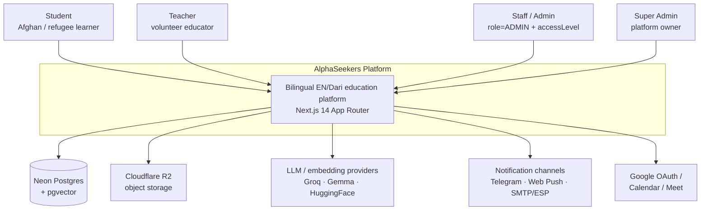
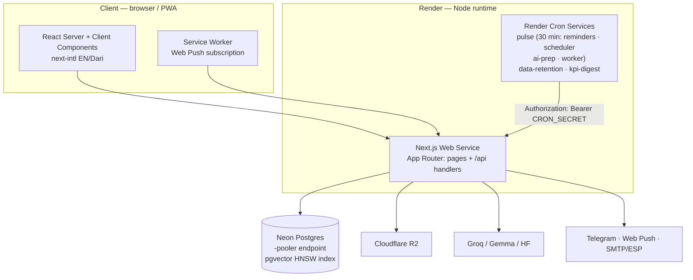
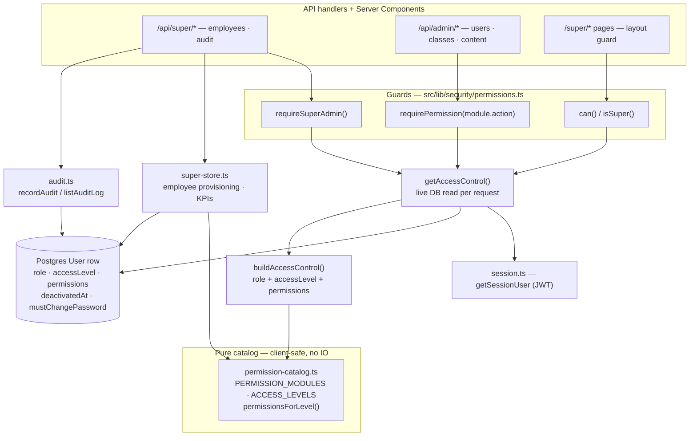
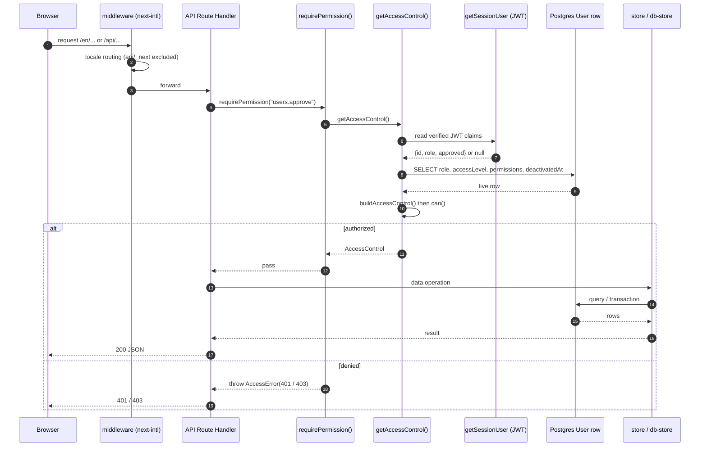
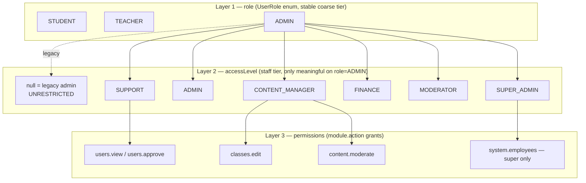
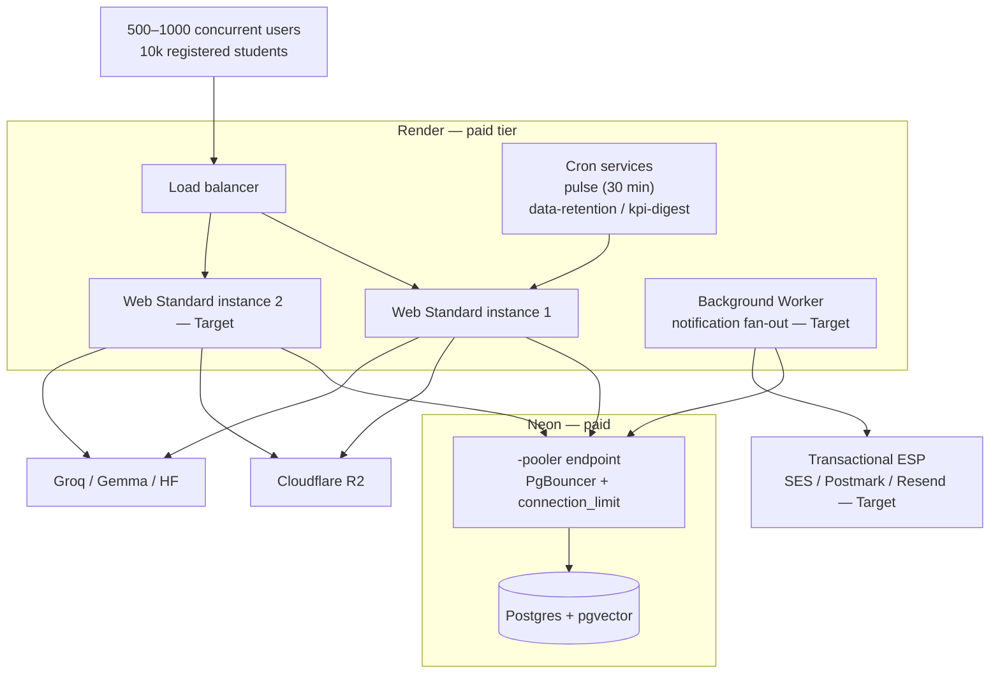

# AlphaSeekers — Architecture Diagrams

Every Mermaid diagram from [`ARCHITECTURE.md`](./ARCHITECTURE.md) collected in one
place for quick reference. Each renders on any Mermaid-aware viewer (GitHub,
VS Code, mermaid.live).

Contents:

1. [C4 L1 — System context](#1-c4-l1--system-context)
2. [C4 L2 — Containers](#2-c4-l2--containers)
3. [C4 L3 — RBAC / Super-Admin components](#3-c4-l3--rbac--super-admin-components)
4. [Data model — entity relationships](#4-data-model--entity-relationships)
5. [Request lifecycle — sequence](#5-request-lifecycle--sequence)
6. [Three-layer access-control model](#6-three-layer-access-control-model)
7. [Target deployment topology](#7-target-deployment-topology)

---

## 1. C4 L1 — System context



---

## 2. C4 L2 — Containers



---

## 3. C4 L3 — RBAC / Super-Admin components



---

## 4. Data model — entity relationships

```mermaid
erDiagram
    User ||--o{ Class : "teaches"
    User ||--o{ Enrollment : "enrolls"
    User ||--o{ Attendance : "attends"
    User ||--o{ Notification : "receives"
    User ||--o{ AIInteraction : "asks"
    User ||--o{ StudentPost : "authors"
    Class ||--o{ Session : "has"
    Class ||--o{ Enrollment : "roster"
    Session ||--o{ Attendance : "records"

    User {
        string id PK
        string email UK
        UserRole role
        string accessLevel "staff tier; null = legacy admin"
        json permissions "module.action grants"
        datetime deactivatedAt "immediate deactivation"
        boolean mustChangePassword
        datetime approvedAt
    }
    Class {
        string id PK
        string teacherId FK
        int maxStudents
        ClassStatus status
    }
    Session {
        string id PK
        string classId FK
        datetime startTime
        string checkinCode "second-layer attendance proof"
    }
    Enrollment {
        string id PK
        string studentId FK
        string classId FK
        EnrollmentStatus status
    }
    Attendance {
        string id PK
        string sessionId FK
        string studentId FK
        boolean attended
        boolean checkinVerified
    }
    Notification {
        string id PK
        string userId FK
        string dedupeKey "unique with channel"
        NotificationChannel channel
        NotificationStatus status
    }
    AIInteraction {
        string id PK
        string userId FK
        string provider "groq / gemma / cache"
        int responseMs
    }
    StudentPost {
        string id PK
        string authorId FK
        string slug UK
        string status "draft / pending_review / published"
    }
    AuditLog {
        string id PK
        string actorId "not FK-constrained by design"
        string action
        string targetType
        string targetId
    }
```

---

## 5. Request lifecycle — sequence



---

## 6. Three-layer access-control model



---

## 7. Target deployment topology


